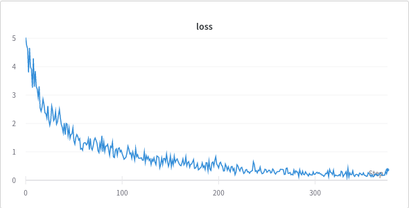
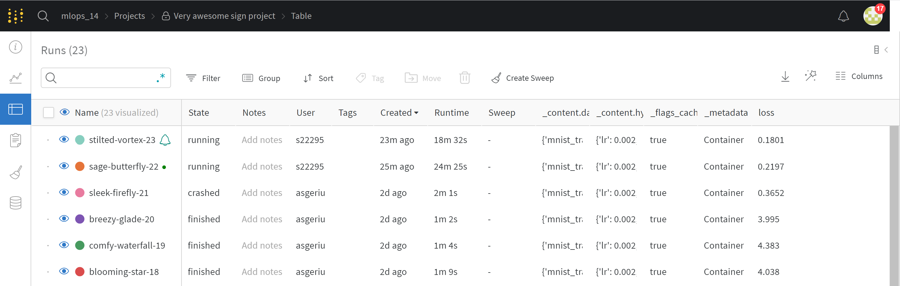
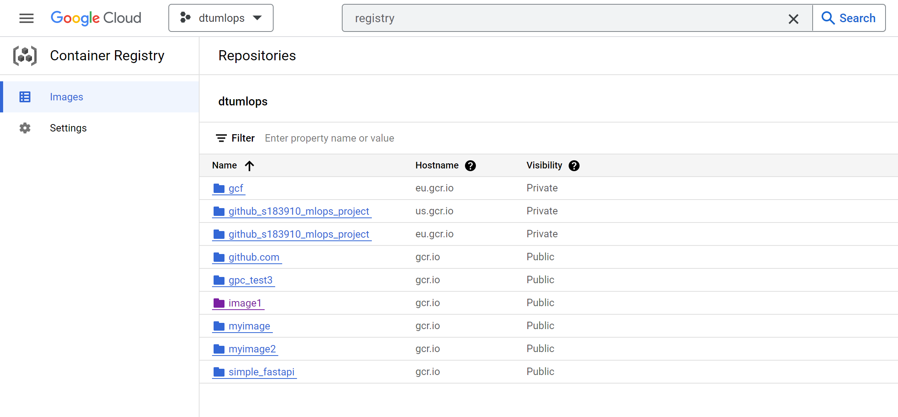
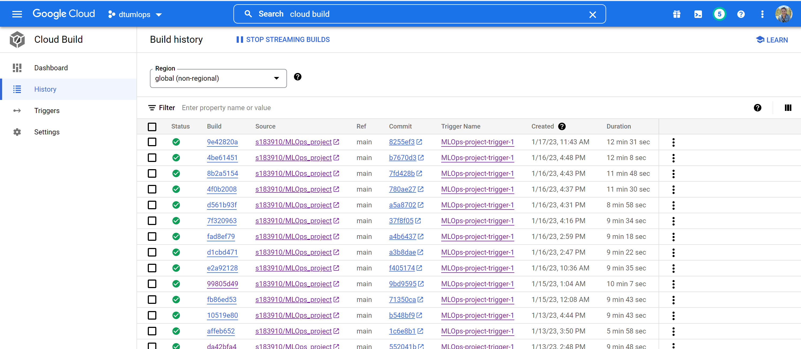
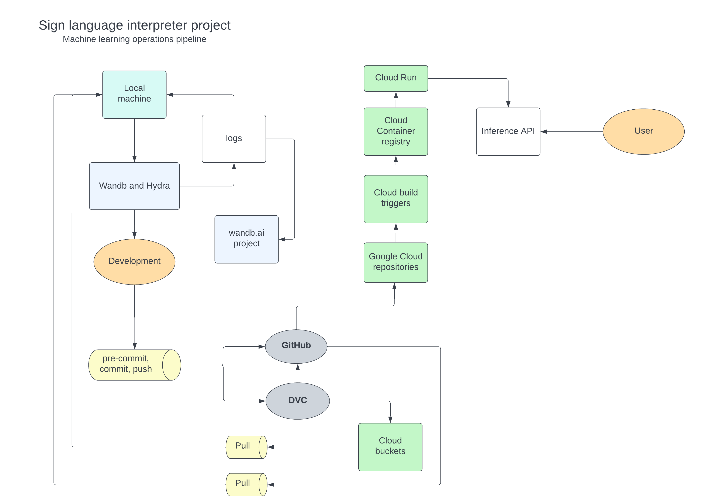

# Exam template for 02476 Machine Learning Operations

This is the report template for the exam. Please only remove the text formatted as with three dashes in front and behind
like:

```--- question 1 fill here ---```

where you instead should add your answers. Any other changes may have unwanted consequences when your report is auto
generated in the end of the course. For questions where you are asked to include images, start by adding the image to
the `figures` subfolder (please only use `.png`, `.jpg` or `.jpeg`) and then add the following code in your answer:

```markdown

```

In addition to this markdown file, we also provide the `report.py` script that provides two utility functions:

Running:

```bash
python report.py html
```

will generate an `.html` page of your report. After deadline for answering this template, we will autoscrape
everything in this `reports` folder and then use this utility to generate an `.html` page that will be your serve
as your final handin.

Running

```bash
python report.py check
```

will check your answers in this template against the constrains listed for each question e.g. is your answer too
short, too long, have you included an image when asked to.

For both functions to work it is important that you do not rename anything. The script have two dependencies that can
be installed with `pip install click markdown`.

## Group information

### Question 1
> **Enter the group number you signed up on <learn.inside.dtu.dk>**
>
> Answer:

14

### Question 2
> **Enter the study number for each member in the group**
>
> Example:
>
> *sXXXXXX, sXXXXXX, sXXXXXX*
>
> Answer:

s183910, s183898, s222955, s183912

### Question 3
> **What framework did you choose to work with and did it help you complete the project?**
>
> Answer length: 100-200 words.
>
> Example:
> *We used the third-party framework ... in our project. We used functionality ... and functionality ... from the*
> *package to do ... and ... in our project*.
>
> Answer:

From the Pytorch ecosystem we have used one of the Pytorch Image models named MobileNet-V2. This is an already pretrained and optimized model which would possibly achieve better performance than if we started from scratch. Like this, we did not need to use much time on building our own model and could focus on implementing our inference solutions more quickly. We did however experience, that our initial 'placeholder' model was performing with higher accuracy.

We have used cookiecutter to set up the prject structure correctly, used hydra and Docker for config files for reproducability, weights and biases for handling hyperparameters, Github and DVC for version control.

We also used the OpenCV for python to showcase the deployed model, and demonstrate the model's translation of a hand gesture into the corresponding letter. Additionally, we used the `request` package in python instead of `curl` to send POST requests to our inference API.

## Coding environment

> In the following section we are interested in learning more about you local development environment.

### Question 4

> **Explain how you managed dependencies in your project? Explain the process a new team member would have to go**
> **through to get an exact copy of your environment.**
>
> Answer length: 100-200 words
>
> Example:
> *We used ... for managing our dependencies. The list of dependencies was auto-generated using ... . To get a*
> *complete copy of our development enviroment, one would have to run the following commands*
>
> Answer:


We used `pipreqs` for generating a dependency list with exact versions.
Development libraries, such as `pytest` were manually maintained in `requirements.txt`.
To get a complete copy of our development environment one would only have to run the `make requirements` command in a python environment of their choice (provided both python and make are already installed).

To obtain the input data one would have to execute the `make data` command which pulls from a dvc remote.

To locally create the training and prediction environments a new team member would have to build the docker images using `docker build -f predict.dockerfile . -t predict:latest` for inference and `docker build -f train.dockerfile . -t train:latest`, or simply `make build-docker-train` and `make build-docker-predict`.

### Question 5

> **We expect that you initialized your project using the cookiecutter template. Explain the overall structure of your**
> **code. Did you fill out every folder or only a subset?**
>
> Answer length: 100-200 words
>
> Example:
> *From the cookiecutter template we have filled out the ... , ... and ... folder. We have removed the ... folder*
> *because we did not use any ... in our project. We have added an ... folder that contains ... for running our*
> *experiments.*
> Answer:


The project is structured using the cookiecutter data science template.
We filled in `predict_model.py` and `train_model.py`, and we added some extra utility files, e.g. `src/data/__init__.py`, which builds the dataset.
We did not fill in `make_dataset.py`, as the the data required very little preprocessing, which was instead done at runtime. For this reason, the folders `interim`, `processed`, and `external` were not used and were therefore removed.

We have added the folder `tests` which contains our unit tests concerning the data and the model.

A `.dvc` folder was also added to store meatfiles associated with data versioning using the cloud. Our training and test dataset was moderately large and was first stored using Google Drive, then GCP Bucket.

Apart from the previous structure we each used the following additional setup locally:

- When running `train_model.py`, data generated by hydra (e.g. logs, configuration files) was saved to a folder named `output` for documentation purposes.
- A folder named `wandb` was added to manage hyperparameters and main visualizations for Weights & Biases.

### Question 6

> **Did you implement any rules for code quality and format? Additionally, explain with your own words why these**
> **concepts matters in larger projects.**
>
> Answer length: 50-100 words.
>
> Answer:

To ensure code similarity, we used the `black` autoformatter, the `isort` utility and the `flake8` linter with slightly altered configurations. These rules were enforced with a pre-commit git hook that made sure no one would forget to use them (see `.pre-commit-config.yaml`).

Good formatting and code quality improves readability, making it easier for all team members to understand and alter parts of the implementation later. In large projects this is especially important since they change a lot over time and many people contribute to them. Without enforced formatting rules the code would quickly become difficult to maintain.

## Version control

> In the following section we are interested in how version control was used in your project during development to
> corporate and increase the quality of your code.

### Question 7

> **How many tests did you implement?**
>
> Answer:

We implemented six unit tests for a coverage of 23 %, focusing mainly on the data and model. These test the shape and dimensions of the input and output of the model and the data samples.
Notably, the training loop and prediction were not covered, as these are larger, self-contained blocks of code where writing unit tests is both harder and provide less benefit over testing stand-alone functions.

The unit tests for data also focus on dataset and batch size when loading.


### Question 8

> **What is the total code coverage (in percentage) of your code? If you code had an code coverage of 100% (or close**
> **to), would you still trust it to be error free? Explain you reasoning.**
>
> **Answer length: 100-200 words.**
>
> Example:
> *The total code coverage of code is X%, which includes all our source code. We are far from 100% coverage of our **
> *code and even if we were then...*
>
> Answer:

The code coverage is 23 %. This is not much, but does cover the central parts which are data loading and inference.
It is important to note that code coverage only measures how much of the code has been run at any point during testing. Therefore it does not guarantee code correctness as tests will rarely cover every input value. This leads to some edge cases not necessarily being discovered. Therefore it is better to concentrate on writing more relevant tests than just aiming for a high code coverage. Furthermore, near 100 % unit test coverage does not guarantee that different components work well together, even if they work as expected individually.

### Question 9

> **Did you workflow include using branches and pull requests? If yes, explain how. If not, explain how branches and**
> **pull request can help improve version control.**
>
> **Answer length: 100-200 words.**
>
> Example:
> *We made use of both branches and PRs in our project. In our group, each member had an branch that they worked on in*
> *addition to the main branch. To merge code we ...*
>
> Answer:

We made use of both branches and pull requests during our project work. We created new branches as we needed them for testing and implementing specific features, followed by creating a pull request for merging the feature branch into the main branch, once the new feature was complete. Hence, we have had a branch for concerning the replacement of model, the implementing of live demo functions in API, for the implementing of pre-commit features and many more. Our practice regarding the pull requests was to always have another group member doing the approving of it. This was done for the sake of practice and for collaboration.

### Question 10

> **Did you use DVC for managing data in your project? If yes, then how did it improve your project to have version**
> **control of your data. If no, explain a case where it would be beneficial to have version control of your data.**
>
> Answer length: 100-200 words.
>
> Example:
> *We did make use of DVC in the following way: ... . In the end it helped us in ... for controlling ... part of our*
> *pipeline*
>
> Answer:

As an initial resolution, we stored the data on Google Drive and used DVC to manage it. Later we improved our storage solution with moving the data from Google drive to the Data Storage buckets in Google Cloud storage, and continued managing it with DVC. This allowed us to change the data if needed without losing history, and it prevented the impracticalities of saving large amounts of data to a git repository.
It also allowed us to make sure that all group memebers had the same data laid out in the same way, which was also useful for pipelines and deployment.

### Question 11

> **Discuss you continues integration setup. What kind of CI are you running (unittesting, linting, etc.)? Do you test**
> **multiple operating systems, python version etc. Do you make use of caching? Feel free to insert a link to one of**
> **your github actions workflow.**
>
> Answer length: 200-300 words.
>
> Example:
> *We have organized our CI into 3 separate files: one for doing ..., one for running ... testing and one for running*
> *... . In particular for our ..., we used ... .An example of a triggered workflow can be seen here: <weblink>*
>
> Answer:

We used Github Actions to implement our continuous integration.
Specifically, it consists of linting with `flake8` and unit testing with `pytest`.
This helps ensure that new merge requests follow the code standards and don't break existing functionality.
As we do not have any platform dependant code, we did not run the pipeline over multiple systems, but we did require both steps to succeed.
Further, as the steps in the pipeline where rather simple, we found it best to keep them in a single flow, which not only meant
we only had to have a single file, but it also reduced runtime by not having to set up twice.
A finished workflow can be seen <a href="https://github.com/s183910/MLOps_project/actions/runs/3955272588">here</a>.

## Running code and tracking experiments

> In the following section we are interested in learning more about the experimental setup for running your code and
> especially the reproducibility of your experiments.

### Question 12

> **How did you configure experiments? Did you make use of config files? Explain with coding examples of how you would**
> **run a experiment.**
>
> Answer length: 50-100 words.
>
> Example:
> *We used a simple argparser, that worked in the following way: python my_script.py --lr 1e-3 --batch_size 25*
>
> Answer:

We stated the hyperparameter values in hydra config files, and used the hydra decorator added to the 'train'-function in the `train_model.py` to input the hyperparameters, and log the performance of the experiment run along with the hyperparameters used. We run an experiment by writting 'make train' in the root directory, which in turn calls the `traine_model.py`. One could also simply write 'python train_model.py', which would result in the same output.

### Question 13

> **Reproducibility of experiments are important. Related to the last question, how did you secure that no information**
> **is lost when running experiments and that your experiments are reproducible?**
>
> Answer length: 100-200 words.
>
> Example:
> *We made use of config files. Whenever an experiment is run the following happens: ... . To reproduce an experiment*
> *one would have to do ...*
>
> Answer:

Config files are one part of the answer. These files are used to make sure that there is no doubt what hyperparameters resulted in which model performance.
DVC also enables us to ensure that the data would be identical from machine to machine, and Docker allowed us to provide a controlled environment with guaranteed library versions, dependencies and packages, making sure that no changed behaviour in different libraries would have an effect.
The only non-reproducibility comes from stochastic processes such as batch shuffling, which we did not control with seeds. Even with seeds, PyTorch does not guarantee exactly the same outputs.

### Question 14

> **Upload 1 to 3 screenshots that show the experiments that you have done in W&B (or another experiment tracking**
> **service of your choice). This may include loss graphs, logged images, hyperparameter sweeps etc. You can take**
> **inspiration from [this figure](figures/wandb.png). Explain what metrics you are tracking and why they are**
> **important.**
>
> Answer length: 200-300 words + 1 to 3 screenshots.
>
> Example:
> *As seen in the first image when have tracked ... and ... which both inform us about ... in our experiments.*
> *As seen in the second image we are also tracking ... and ...*
>
> Answer:

The first figure shows a simple training loss curve tracked and visualized in Weights & Biases.
This is one of the most important metrics to track during training. This metric can inform us about the stability of the training as well as whether the model ends up overfitting during training. From that we as developers can optimize the model, change hyperparameters or train for a shorter period of time.

The second figure shows how Weights & Biases was uses to track different experiments. In the WandB website we are able to filter the experiment runs by the choice of hyperparameter and other variables. It provides important information concerning each model training like the state of the run, the runtime, the loss obtained etc.

This is one way to overcome the classical problem of accidentally overriding previous experiments or messing up which were which.

We did not perform a sweep, hence not using the extension of weights and biases to optimize the hyperparameters. We found logging the performance using hydra to be sufficient for this project, although we would definitely consider using sweep with weights and biases for more elaborate projects in the future, along with the easy sharing of performance plots.





### Question 15

> **Docker is an important tool for creating containerized applications. Explain how you used docker in your**
> **experiments? Include how you would run your docker images and include a link to one of your docker files.**
>
> Answer length: 100-200 words.
>
> Example:
> *For our project we developed several images: one for training, inference and deployment. For example to run the*
> *training docker image: `docker run trainer:latest lr=1e-3 batch_size=64`. Link to docker file: <weblink>*
>
> Answer:

The image defined by `trainer.dockerfile` was used locally to train the model on pre-available data and save the resulting model state in a shared directory.

The image defined by `predict.dockerfile` was used to load the trained model state, test some pre-available data and output the computed accuracy of the model.
These two files are used for local deployment and primarily differ in their entry points, with one starting training and the other evaluation.

The dockerfile found at `api/gcp_run/dockerfile` is used for deploying to GCP. THis does not have an entry point, but instead uses `CMD` to start the inference api.

### Question 16

> **When running into bugs while trying to run your experiments, how did you perform debugging? Additionally, did you**
> **try to profile your code or do you think it is already perfect?**
>
> Answer length: 100-200 words.
>
> Example:
> *Debugging method was dependent on group member. Some just used ... and others used ... . We did a single profiling*
> *run of our main code at some point that showed ...*
>
> Answer:

We did not enforce debugging practices, as we found this was best left to individual preferences and circumstances.
The debugging methods used ranged from VS Code's built-in debugger to the IPython debugger (`ipdb`) to the never-failing `print` spam.

We profiled our code after we got the main flows working to make sure that we were satisfied with the runtime. As would be expected, the main bottlenecks were the neural networks.

## Working in the cloud

> In the following section we would like to know more about your experience when developing in the cloud.

### Question 17

> **List all the GCP services that you made use of in your project and shortly explain what each service does?**
>
> Answer length: 50-200 words.
>
> Example:
> *We used the following two services: Engine and Bucket. Engine is used for... and Bucket is used for...*
>
> Answer:


We made use of the following services on google cloud platform:
Cloud storage was used to store both our data and Docker images remotely.
A GCP Bucket was set up as the remote target for data version control enabling us to push and pull from the cloud.

Triggers were set up to build the trainer and predictor docker images whenever there is a push to the main branch of the cloud repository (which is set up to track the git repository).
All the container images that were built during the project can be viewed on the Container Registry.

The inference API was built and deployed using Cloud Run and Cloud Functions in the following way:


### Question 18

> **The backbone of GCP is the Compute engine. Explained how you made use of this service and what type of VMs**
> **you used?**
>
> Answer length: 50-100 words.
>
> Example:
> *We used the compute engine to run our ... . We used instances with the following hardware: ... and we started the*
> *using a custom container: ...*
>
> Answer:

We have created three different compute engine instances, where each instance is a virtuel machine. These were created in relation to the setup of Vertex AI in google cloud, which is meant to be used for training the model in the cloud. Each VM was created with the machine type e2-medium, with vCPU of one shared core and 4 GB memory.

### Question 19

> **Insert 1-2 images of your GCP bucket, such that we can see what data you have stored in it.**
> **You can take inspiration from [this figure](figures/bucket.png).**
>
> Answer:


### Question 20

> **Upload one image of your GCP container registry, such that we can see the different images that you have stored.**
> **You can take inspiration from [this figure](figures/registry.png).**
>
> Answer:




### Question 21

> **Upload one image of your GCP cloud build history, so we can see the history of the images that have been build in**
> **your project. You can take inspiration from [this figure](figures/build.png).**
>
> Answer:




### Question 22

> **Did you manage to deploy your model, either in locally or cloud? If not, describe why. If yes, describe how and**
> **preferably how you invoke your deployed service?**
>
> Answer length: 100-200 words.
>
> Example:
> *For deployment we wrapped our model into application using ... . We first tried locally serving the model, which*
> *worked. Afterwards we deployed it in the cloud, using ... . To invoke the service an user would call*
> *`curl -X POST -F "file=@file.json"<weburl>`*
>
> Answer:

We deployed the model using FastAPI, docker and Cloud RUN.

A POST request is used in FastAPI to receive a list of png images, which are then processed in a separate python file, which includes reshaping, converting to greyscale, and converting to tensor. The tensors are used for inference, and the resulting letter is returned to the client as a response. To deploy the API, Cloud RUN is used, which requires a dockerfile, to Cloud Build our api image. By referencing our Cloud repository (which is linked to our Git repository) along with the location of our API dockerfile, a trigger is set such that (only) commits that include changes to files in our api folder, will trigger a new build. Cloud RUN returns a url endpoint for the API which can now be accessed 24/7 and independently of our own computers.

To test the API another python script was written which used opencv to stream images from a webcam. These are POST-ed to the API and the predicted letter is received as a response.
Postman was used for testing.

### Question 23

> **Did you manage to implement monitoring of your deployed model? If yes, explain how it works. If not, explain how**
> **monitoring would help the longevity of your application.**
>
> Answer length: 100-200 words.
>
> Example:
> *We did not manage to implement monitoring. We would like to have monitoring implemented such that over time we could*
> *measure ... and ... that would inform us about this ... behaviour of our application.*
>
> Answer:

According to the course material, we set a function invocation counter where an alert is fired if the function is invoked more than twice during a 5 minute period. This was only used as a test alert and probably more fine-tuned parameters would be needed in the future.

Overall we did not prioritize this topic as it seems Google Cloud does quite a bit of monitoring, in terms of security, activity, speed, etc. It is also possible to set a maximum number of requests and "Cloud Armor Network Security" can protect against e.g. DDoS attacks.
Due to time constraints the API is not programmed to handle bad requests (e.g. wrong file formats or images too small to resize).

It could be interesting to log the images sent to the API, along with statistics on classes but this does pose some ethics questions regarding anonymity and privacy. It is clear that the model currently performs very poorly against input images, and it would be cool to have another API endpoint that in addition to an image also recieves a label, such that we could extend our dataset remotely with webcams, by e.g. typing the letter we are presenting to the webcam.


### Question 24

> **How many credits did you end up using during the project and what service was most expensive?**
>
> Answer length: 25-100 words.
>
> Example:
> *Group member 1 used ..., Group member 2 used ..., in total ... credits was spend during development. The service*
> *costing the most was ... due to ...*
>
> Answer:

One group member has used approximately 33 credits, another have used none. The remainin two group members ran into problems concerning 'denied permission' to access the billing information, and the issue was not resolved in time, hence also no credits. Thereby, 33 credits used in total.

## Overall discussion of project

> In the following section we would like you to think about the general structure of your project.

### Question 25

> **Include a figure that describes the overall architecture of your system and what services that you make use of.**
> **You can take inspiration from [this figure](figures/overview.png). Additionally in your own words, explain the**
> **overall steps in figure.**
>
> Answer length: 200-400 words
>
> Example:
> *
> *The starting point of the diagram is our local setup, where we integrated ... and ... and ... into our code.*
> *Whenever we commit code and puch to github, it auto triggers ... and ... . From there the diagram shows ...*
>
> Answer:


The diagram shows the machine learning pipeline of our system. The diagram's starting point is our local setup which is connected to the weights and bias account logging hyperparameters as well as the hydra config files. The logs produced by training a model locally can be visualized using the wandb.ai project website.

From the development point of view, the next steps are the pre-commit, commit, and push to the Github of the project and the dvc. The dvc will push some files and dependencies to cloud buckets, while keeping the verison info on Github. The local machine is able to access the files from the cloud buckets (data) and updates in code from the Github repository via pull commands.

Looking at the Github representation on the pipeline diagram, four Google cloud related actions follow. These actions are responsible for storage, and monitoring on Google cloud. Whenever we push source code to the main branch on github, or build a new docker image, a trigger in Google cloud is activated, which helps us monitor the project builds. From the last and outer right part of the diagram the inference API is seen, and for this, Google run is the backend, which a user can access to use our application.


### Question 26

> **Discuss the overall struggles of the project. Where did you spend most time and what did you do to overcome these**
> **challenges?**
>
> Answer length: 200-400 words.
>
> Example:
> *The biggest challenges in the project was using ... tool to do ... . The reason for this was ...*
>
> Answer:

Setting up the deployment environment and the Google cloud hosting proved to be the most difficult and time consuming part of the project. This was mainly because the team was not very familiar with the Google Cloud platform's machine learning solutions, so even making sense of the interface was a bit overwhelming. It took a lot of trial and error and meticulous tutorial and documentation reading to finish setting up the whole pipeline but we managed to pull through.

Setting up docker was also a time consuming process since if a missing file or a wrong command was discovered too late in the configuration file then the whole container had to be rebuilt (which resulted in a fairly slow feedback loop during development).

A more personal struggle of the team was coordinating work during the last two weeks as one of the members had to relocate to the United States. We overcame this difficulty by planning early, sharing end-of-day status reports with each other via slack and consulting by call when the time difference allowed it.

Additionally, an obstacle which we encountered was one group member accidentally working on a google cloud project with the same name as as the actual project. It took some time before the group figured out the mistake and some work had to be re-done.
Apart from these slight hiccups the overall experience of completing this project was a positive one.

### Question 27

> **State the individual contributions of each team member. This is required information from DTU, because we need to**
> **make sure all members contributed actively to the project**
>
> Answer length: 50-200 words.
>
> Example:
> *Student sXXXXXX was in charge of developing of setting up the initial cookie cutter project and developing of the*
> *docker containers for training our applications.*
> *Student sXXXXXX was in charge of training our models in the cloud and deploying them afterwards.*
> *All members contributed to code by...*
>
> Answer:

In general students contributed equally to the project, and we often worked side-by-side. Everyone worked on the documentation of the project as well.

In case specific contributions are needed:

Katrine Bay s183910: Cookie-cutter, Git repo and Google Cloud setup, Buckets, Weights and biases setup and reports.

Rasmus Bryld s183898: FastAPI, Cloud Run deployment, Demo.

Asger Schultz s183912: Pre-trained model setup, docker, Git actions.

Eper Stinner s222955: Initial model setup, docker/Makefile, Git CI, pre-commits, docker build trigger on GCP.
